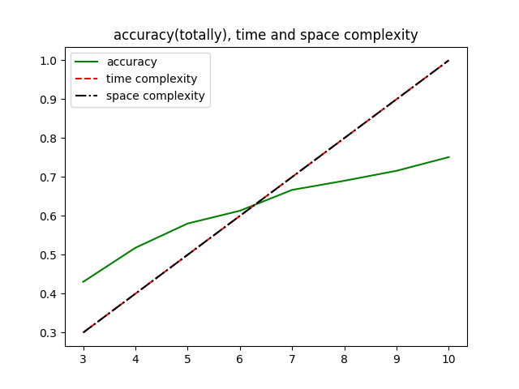
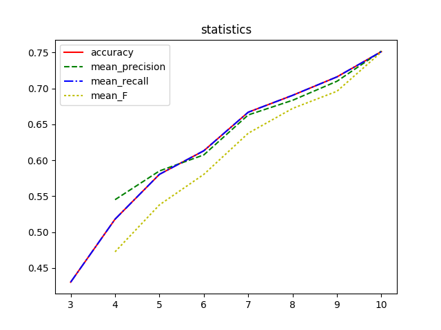
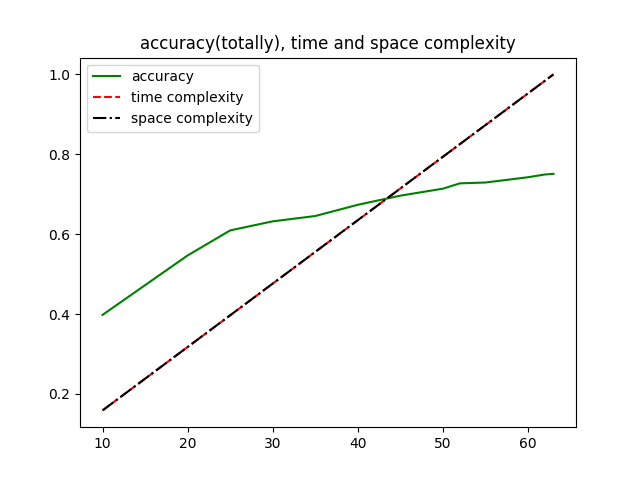
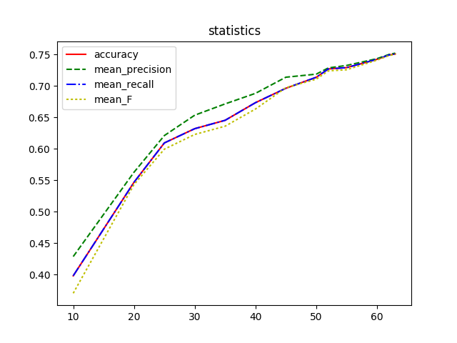

# 实现一个压缩的深度神经网络

**注：请在typora或其它支持Markdown公式语法的阅读器下阅读本文档.**

## 动机

深度神经网络中, 全连接网络层的参数占据的存储空间比较大, 在深度卷积神经网络中, 全连接层的参数占据了参数存储空间的90%以上.[1] 深度学习算法是计算密集型和存储密集型的[2], 使得它难以部署在拥有有限硬件资源的嵌入式系统上. 为了降低参数所占用的存储空间, 提高预测效率, 使用奇异值分解的方法(SVD)对全连接层的参数矩阵进行压缩, 并研究模型预测准确度与压缩率的关系.

## 实验环境
	操作系统: Arch Linux 4.10.8
	深度学习框架: Caffe(Apr 7,2017)
	编程语言: Python 2.7.13
	编译器: g++ (GCC) 6.3.1 20170306
			Cuda compilation tools, release 8.0, V8.0.44
	数据库: lmdb
	图像处理库: OpenCV3
	环境配置:
	CPU: Intel(r) Core(tm) i7-4702MQ CPU @ 2.20GHZ
	GPU: NVIDIA Corporation GK107M [GeForce GT 750M]

## 文件说明

|文件名|说明|
|------|----|
|test.py|压缩IP2全连接层, 可以通过修改SVD_R变量改变压缩参数|
|test2.py|压缩IP1全连接层, 可以通过修改SVD_R变量改变压缩参数|
|improve_model_ip1.py|使用SVD, 聚类，Reduced-Precision方法压缩|
|improve_ip1_new.py|压缩IP1全连接层后进行fine-tune|
|improve_ip2.py|压缩IP2全连接层后以原参数为初值，进行fine-tune|
|improve_ip2_new.py|压缩IP2全连接层后保存caffemodel(不进行fine-tune)|
|noimprove_ip2.py|随机初始化权重，重新训练被压缩ip2层后的网络|
|eval_model_ip1.py|评估压缩ip1层后的性能, 在result文件夹生成对应的*.npy文件|
|eval_model_ip2.py|评估压缩ip2层后的性能, 在result文件夹生成对应的*.npy文件|
|evaluate.py|读取result文件夹下的*.npy文件并进行评估|
|base.py|基本操作，比如proto模板生成, 模型评分|
|build.sh|训练脚本|
|chart.py|显示压缩ip2层的对比结果|
|chart2.py|显示压缩ip1层的对比结果|
|chart_imp.py|绘制改进的压缩方法(retrain)的结果图|
|convert_mean.py|将mean.binaryproto转换为mean.npy|
|mcluster.py|使用K-means对全连接层进行压缩|
|analyze_ipZ.py|分析ipZ层|
|mean.npy|图像均值文件|
|label.npy|图像测试集的标签文件|

|文件夹|说明|
|------|----|
|build/|SVD压缩ip2后训练网络的文件|
|build_ip1/|SVD压缩ip1后训练网络的文件|
|proto/|proto和proto模板, 自动化脚本模板|
|pic/|文档图片|
|slides/|演示文件，介绍了项目的压缩方法|

## 深度神经网络
- 数据集
  数据集名称: CIFAR-10 dataset
  每个样本为: 32 $$\times$$ 32的三通道(RGB)图片
  分类数: 10

| 数据集名称 | 总样本数  | 每个分类的样本数 |
| ----- | ----- | -------- |
| 训练集   | 50000 | 5000     |
| 测试集   | 10000 | 1000     |

- 网络模型
   * 训练网络时的神经网络定义
     cifar10_quick_train_test.prototxt
     conv1: data  -> conv1
     pool1: conv1 -> pool1
     relu1: pool1 -> pool1
     conv2: pool1 -> conv2
     relu2: conv2 -> conv2
     pool2: conv2 -> pool2
     conv3: pool2 -> conv3
     relu3: conv3 -> conv3
     pool3: conv3 -> pool3
     ip1  : pool3 -> ip1
     ip2  : ip1   -> ip2
     accuracy[TEST]: ip2, label -> accuracy
     loss(softmax with loss): ip2, label -> loss
   * 训练结束后保存的神经网络的定义 
     conv1: data  -> conv1
     pool1: conv1 -> pool1
     relu1: pool1 -> pool1
     conv2: pool1 -> conv2
     relu2: conv2 -> conv2
     pool2: conv2 -> pool2
     conv3: pool2 -> conv3
     relu3: conv3 -> conv3
     pool3: conv3 -> pool3
     ip1  : pool3 -> ip1
     ip2  : ip1   -> ip2
     prob : ip2   -> prob

   其中ip指InnerProduct, 即全连接层.

## 方法
- 奇异值(SVD)分解
  奇异值分解能够提取矩阵的重要特征, 它可以对任何形状的矩阵进行分解.
  $$A=U{\sum}V^T$$

- 部分奇异值分解
  部分奇异值分解可以对矩阵的存储空间进行压缩
  假设矩阵A的大小为$$m\times n$$, 奇异值分解后得到:
  $$A_{m\times n}=U_{m\times m}{\sum}_{m\times n}{V^T}_{n\times n}$$
  $${\sum}$$为对角矩阵, 奇异值沿着对角线从大到小排列, 选取前r个奇异值来近似矩阵A, 有:
  $$A_{m\times n}{\approx}U_{m\times r}{\sum}_{r\times r}{V^T}_{r\times n}$$
- 使用SVD对神经网络的全连接层进行压缩
  首先需要训练一遍深度神经网络, 然后使用SVD方法对全连接层的参数矩阵进行压缩.
  设神经网络的某一层全连接层的参数矩阵为$$W \in R^{m\times n}$$, 偏差向量为$$b \in R^m$$
  输入向量: $$x \in R^n$$, 输出向量: $$y \in R^m$$
  全连接层输入输出的关系:
  $$y = Wx + b$$
  对W进行奇异值分解:
  $$W = U_{m\times m}{\sum}_{m\times n}{V^T}_{n\times n}$$
  进行部分奇异值分解:
  $$W_{m\times n}{\approx}U_{m\times r}{\sum}_{r\times r}{V^T}_{r\times n}$$
  其中, $$r <= min(m, n)$$
  部分奇异值分解后, 原全连接层可以分为三个全连接层或两个全连接层, 但是不同的划分组合的时间复杂度与空间复杂度是不一样的

- 不同划分方式对应的时间复杂度与空间复杂度
| 划分方式                                     | 层数   | 时间复杂度            | 空间复杂度            |
| ---------------------------------------- | ---- | ---------------- | ---------------- |
| 不压缩                                      | 1    | $$O(mn)$$        | $$O(mn)$$        |
| $$(U_{m\times r}{\sum}_{r\times r}){V^T}_{r\times n}$$ | 2    | $$O(mr+rn)$$     | $$O(mr+rn)$$     |
| $$U_{m\times r}({\sum}_{r\times r}{V^T}_{r\times n})$$ | 2    | $$O(mr+rn)$$     | $$O(mr+rn)$$     |
| $$U_{m\times r}{\sum}_{r\times r}{V^T}_{r\times n}$$ | 3    | $$O(mr+r^2+rn)$$ | $$O(mr+r^2+rn)$$ |

注: 上述表格中, 括号表示将多个矩阵合并为一个矩阵. 时间复杂度指的是一个输入经过原全连接层或压缩后生成的多个全连接层的时间复杂度, 由于参数矩阵比较大, 忽略偏差矩阵所占的空间以及计算时使用的时间.

从表格上可以看到, 当全连接层的参数矩阵被拆分为两层时, 其时间复杂度和空间复杂度比拆分成三层的情况低. 将一个矩阵拆分成两层全连接网络有两种方式, 它们的时间复杂度和空间复杂度是一样的, 当$$mr + rn < mn$$时, 即 $$r < \frac{mn}{m+n}$$时, 使用SVD压缩参数矩阵, 在时间复杂度和空间复杂度上有优势.

记要压缩的全连接层为$$ip_x$$, 其参数矩阵为W, 偏差向量为b
对参数矩阵W进行SVD分解后, 
令$$Z={\sum}V^T$$, 则$$y = U(Zx) + b$$
原全连接层被分为两个新的且更小的全连接层
即: 输入 -> W,b -> 输出
变为: 输入 -> Z,0 -> U,b -> 输出
全连接层Z的偏差向量全部取0, 全连接层U的偏差向量为b.

caffe自带的cifar10_quick样例有两个全连接层:
| 全连接层名称 | 输入特征数 | 输出特征数 |
| ------ | ----- | ----- |
| ip1    | 1024  | 64    |
| ip2    | 64    | 10    |

## 结果分析
- 未压缩全连接层前的预测精度 
  caffe自带的cifar10_quick神经网络经过训练后, 准确度达到了0.7511
- 压缩全连接层ip2
  使用SVD压缩全连接层ip2的参数矩阵:
  $$W_{m\times n}{\approx}U_{m\times r}{\sum}_{r\times r}{V^T}_{r\times n}$$
  $$r$$分别取值为从3到10的整数. 引入统计量accuarcy, precision, recall 和 F value
  $$压缩率 = \frac{新参数矩阵存储空间大小}{原参数矩阵存储空间大小}$$
  压缩率越小, 代表压缩后的存储空间越小.
  | r            | accuracy | mean precision | mean recall | mean F   | time | space | compression rate |
  | ------------ | -------- | -------------- | ----------- | -------- | ---- | ----- | ---------------- |
  | uncompressed | 0.751100 | 0.751777       | 0.751100    | 0.750558 | 640  | 640   | 100.00%          |
  | 10           | 0.751100 | 0.751777       | 0.751100    | 0.750558 | 740  | 740   | 115.62%          |
  | 9            | 0.716000 | 0.709909       | 0.716000    | 0.696003 | 666  | 666   | 104.06%          |
  | 8            | 0.690300 | 0.683415       | 0.690300    | 0.672081 | 592  | 592   | 92.50%           |
  | 7            | 0.666800 | 0.663032       | 0.666800    | 0.637553 | 518  | 518   | 80.94%           |
  | 6            | 0.613200 | 0.607457       | 0.613200    | 0.580367 | 444  | 444   | 69.38%           |
  | 5            | 0.580400 | 0.585117       | 0.580400    | 0.537906 | 370  | 370   | 57.81%           |
  | 4            | 0.518000 | 0.545117       | 0.518000    | 0.472613 | 296  | 296   | 46.25%           |
  | 3            | 0.430400 | nan            | 0.430400    | nan      | 222  | 222   | 34.69%           |

可以看到, 当$$r >= 9$$时, 准确度没有提升, 压缩率反而增大.
$$r = 10$$的预测结果和未压缩的神经网络的预测结果是一致的, 因为其保留了SVD分解的完整结果, 然而保存多个矩阵导致空间复杂度和时间复杂度增高.
随着r值的降低, 准确度和压缩率都在降低.
当r = 3的时候, 已经存在某个分类无法被预测出来. 
由于被压缩的全连接网络层ip2的参数矩阵大小为$$10\times 64$$, 矩阵占用的存储空间很小, 被SVD方法压缩后容易出现欠拟合的现象, 导致准确度降低, 比较难体现出参数矩阵被压缩的优势.

ip2的参数矩阵经过SVD分解后, 
$\sum$的对角线元素即奇异值为:
[ 1.02686238,  0.86153692,  0.77797216, 0.75643724,  0.7272585,
0.67449301, 0.62932462,  0.57285255,  0.51419431,  0.45387536]

奇异值之间差异不大, 说明奇异向量的重要性相差不远.
当r逐步变小时, 神经网络的准确度降低得比较快.

- 压缩全连接层ip1
  我也尝试了保持全连接层ip2不变, 对全连接层ip1($$64\times 1024$$)进行SVD分解, 
  ip1的参数矩阵的最大奇异值为3.354, 最小奇异值为2.059, 两者相差也不大.
  当对ip1进行压缩时, 得到以下结果:  
  | r            | accuracy | mean precision | mean recall | mean F   | time  | space | compression rate |
  | ------------ | -------- | -------------- | ----------- | -------- | ----- | ----- | ---------------- |
  | uncompressed | 0.751100 | 0.751777       | 0.751100    | 0.750558 | 65536 | 65536 | 100.00%          |
  | 63           | 0.751000 | 0.752306       | 0.751000    | 0.750361 | 68544 | 68544 | 104.59%          |
  | 62           | 0.749400 | 0.750306       | 0.749400    | 0.748556 | 67456 | 67456 | 102.93%          |
  | 60           | 0.742500 | 0.743564       | 0.742500    | 0.741240 | 65280 | 65280 | 99.61%           |
  | 55           | 0.729300 | 0.732731       | 0.729300    | 0.725926 | 59840 | 59840 | 91.31%           |
  | 52           | 0.727200 | 0.728836       | 0.727200    | 0.724121 | 56576 | 56576 | 86.33%           |
  | 50           | 0.713900 | 0.718902       | 0.713900    | 0.710930 | 54400 | 54400 | 83.01%           |
  | 45           | 0.696400 | 0.714023       | 0.696400    | 0.697290 | 48960 | 48960 | 74.71%           |
  | 40           | 0.673500 | 0.688363       | 0.673500    | 0.663389 | 43520 | 43520 | 66.41%           |
  | 35           | 0.645400 | 0.671528       | 0.645400    | 0.636024 | 38080 | 38080 | 58.11%           |
  | 30           | 0.632100 | 0.653558       | 0.632100    | 0.622893 | 32640 | 32640 | 49.80%           |
  | 25           | 0.609400 | 0.621119       | 0.609400    | 0.599473 | 27200 | 27200 | 41.50%           |
  | 20           | 0.546700 | 0.562711       | 0.546700    | 0.543171 | 21760 | 21760 | 33.20%           |
  | 10           | 0.397900 | 0.428503       | 0.397900    | 0.370067 | 10880 | 10880 | 16.60%           |

随着r的减小, 神经网络的准确度在降低.
压缩ip1层时, 同样存在r接近min(m,n)时压缩率大于100%的情况. 
当只对ip1进行SVD压缩时, 压缩率为74.71%时, 准确度为0.696. 
时间,空间复杂度减少了$$64 \times 1024 \times (100\% - 74.71\%) = 16574$$
而只对ip2进行SVD压缩时, 压缩率为92.50%时, 准确度为0.690. 
时间,空间复杂度减少了$$10 \times 64 \times (100\% - 92.50\%) = 48$$
同等准确度的情况下, 压缩较大的全连接层, 得到的效果更好.

## 改进
在上述对全连接层压缩的方法中, 用了两个小的全连接层替代原来的大的全连接层.
其中靠近输出的一个小的全连接层的偏差向量为大的全连接层的偏差向量, 而靠近输入的小的全连接层的偏差向量的元素全部为0.
偏差向量的元素全部为0浪费了存储空间, 我想到了有两种方法解决这个问题:
一种解决方法为删除全0的偏差向量, 另一种方法为利用该偏差向量对神经网络再进行一次修正, 弥补部分SVD分解时带来的损失.
- 利用全零偏差向量弥补压缩的损失
  对于某个全连接层, 有$$y = Wx + b$$
  进行部分SVD分解后, 得到y的估计$$y' = U_{m\times r}{\sum}_{r\times r}{V^T}_{r\times n}x + b$$
  令$$Z = {\sum}_{r\times r}{V^T}_{r\times n}$$, 将参数矩阵为W的全连接层分为两个更小的全连接层.
  有$$y' = U_{m\times r}(Zx + g) + b$$
  其中g是参数矩阵为Z的全连接层的偏差向量
  对于样本i, 存在误差$$err_i = \frac{1}{2}(y - y')^2 $$
  得到$$err_i = \frac{1}{2}[(W - U_{m\times r}Z)x_i + U_{m\times r}g]^2$$
  记$$D = W - U_{m\times r}$$, $$D$$不变
  最小化$$J = \sum_{i = 1}^{m}err_i$$, 有$$g = {U_{m\times r}}^{-1}mean(Dx_i), i = 1,2,3,...,m $$
  经验证, 该校正方法计算出的$$g$$值很接近零矩阵, 对模型的准确度提升没有帮助. 
- 校正模型 
  对全连接层进行压缩后, 以原有的模型参数作为初始值, 用训练样本再训练一次模型.
  | r              | accuracy | mean precision | mean recall | mean F   | time | space | compression rate |
  | -------------- | -------- | -------------- | ----------- | -------- | ---- | ----- | ---------------- |
  | uncompressed   | 0.751100 | 0.751777       | 0.751100    | 0.750558 | 640  | 640   | 100.00%          |
  | 9(unimproved)  | 0.716000 | 0.709909       | 0.716000    | 0.696003 | 666  | 666   | 104.06%          |
  | 8(retrain4500) | 0.715300 | 0.714202       | 0.715300    | 0.712567 | 592  | 592   | 92.50%           |
  | 8(improved500) | 0.712700 | 0.717100       | 0.712700    | 0.712591 | 592  | 592   | 92.50%           |
  | 6(retrain4500) | 0.702100 | 0.704799       | 0.702100    | 0.700917 | 444  | 444   | 69.38%           |
  | 6(improved500) | 0.693100 | 0.697976       | 0.693100    | 0.691144 | 444  | 444   | 69.38%           |
  | 8(unimproved)  | 0.690300 | 0.683415       | 0.690300    | 0.672081 | 592  | 592   | 92.50%           |
  | 4(retrain4500) | 0.670500 | 0.672067       | 0.670500    | 0.669481 | 296  | 296   | 46.25%           |
  | 4(improved500) | 0.657000 | 0.660422       | 0.657000    | 0.657608 | 296  | 296   | 46.25%           |
  | 6(unimproved)  | 0.613200 | 0.607457       | 0.613200    | 0.580367 | 444  | 444   | 69.38%           |
  | 4(unimproved)  | 0.518000 | 0.545117       | 0.518000    | 0.472613 | 296  | 296   | 46.25%           |

其中, uncompressed代表未压缩的网络
unimporved代表刚压缩的网络
improved500代表网络压缩后, 基于当前的模型参数, 用训练样本训练500代;
retrain4500代表网络压缩后, 重新初始化模型参数, 用训练样本训练4500代.
可以看到, improved和retrain模型的准确度相对于unimproved, 都得到了改进.
然而重新训练得到的模型的准确度比压缩后微调的模型的准确度更高.
- 自动压缩全连接层
  从"结果分析"中的列表可以看到, 在同等准确度的情况下, 压缩规模较大的全连接层能得到更好的压缩效果.
  在SVD分解中, 奇异值越大, 对应的左奇异向量以及右奇异向量的重要性越强. 将奇异值从大到小排序后, 若较大的奇异值与较小的奇异值相差很远, 取较大的奇异值对应的部分就可以近似原矩阵. 
  对每一层的参数矩阵进行SVD分解, 奇异值从大到小排序后有$$[s_1, s_2, s_3, ..., s_m]$$
  若$$\frac{s_i}{s_{i+1}} > threshold$$, 则取r = i, 参数矩阵$$W_{m\times n}{\approx}U_{m\times r}{\sum}_{r\times r}{V^T}_{r\times n}$$
- 通过剪枝(pruning), 量化(quantization)和哈夫曼编码(Huffman Coding)压缩深度神经网络 
  Song Han, Huizi Mao, William J. Dally. Deep Compression的<Compressing Deep Neural Networks with Pruning, Trained Quantization and Huffman Coding>论文中提到用剪枝, 量化, 哈夫曼编码的方法对深度神经网络进行压缩, 这些方法是在神经网络训练后进行的.

  - 剪枝
    删除权重小于一定阈值的连接, 对稀疏连接进行再训练. 
  - 量化
    使用K-means算法将不同的权重聚类, 每个聚类共享一个权值, 在网络进行更新时, 将一个聚类内的所有梯度相加, 更新该聚类中的共享权值.
  - 哈夫曼编码
    对不同的聚类进行哈夫曼编码.

## 参考资料
[1] Zichao Yang,Marcin Moczulski,Misha Denil,Nando de Freitas,Alex Smola,Le Song,Ziyu Wang. Deep Fried Convnets. Arxiv, 1412.7149, 2015
[2] Song Han, Huizi Mao, William J. Dally. Deep Compression: Compressing Deep Neural Networks with Pruning, Trained Quantization and Huffman Coding. Arxiv, 1510.00149. 2016.
[3] LeftNotEasy, 机器学习中的数学(5)-强大的矩阵奇异值分解(SVD)及其应用, http://www.cnblogs.com/LeftNotEasy/archive/2011/01/19/svd-and-applications.html
